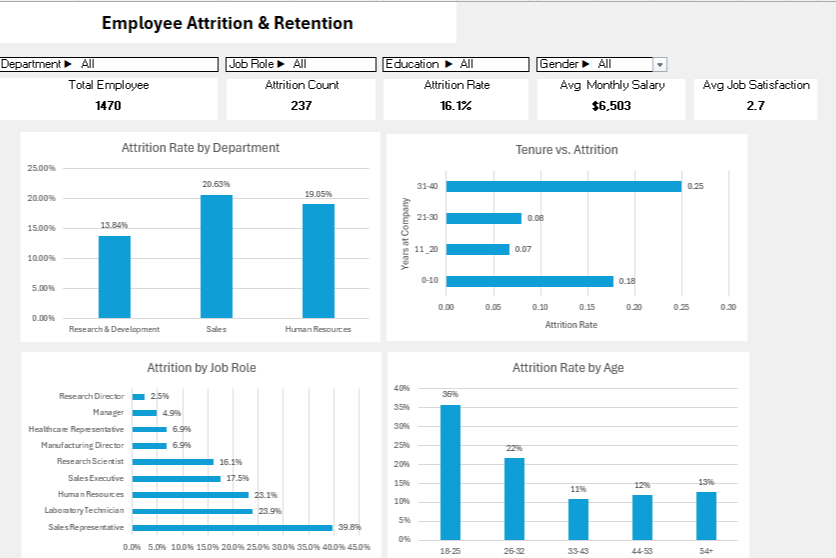

# 📊 Employee Attrition & Retention Analysis

Understanding why employees leave a company is crucial for improving retention and building a healthier workplace. In this project, I dive deep into a real HR dataset to uncover patterns behind employee attrition using both **Excel dashboards** and **SQL analysis**.

---

## 📁 Dataset

- Source: IBM HR Analytics Employee Attrition & Performance dataset  
- Rows: 1,470 employees  
- Columns: Demographics, job details, performance metrics, and attrition status

---

## 🧠 The Story Behind the Project

Imagine you're a data analyst at a mid-sized company. Your manager approaches you with a concern: **"We're losing too many employees — can you find out why?"**

That question became the starting point of this project.

To answer it, I:
- Built a dynamic **Excel dashboard** to let stakeholders explore attrition metrics interactively
- Ran detailed **SQL queries** to uncover which factors most strongly correlate with employees leaving

---

## 📷 Dashboard Preview

---

## 🔍 Key Questions I Answered

- Which departments and job roles have the highest attrition rates?
- Does job satisfaction play a role in employee turnover?
- Are younger employees more likely to leave?
- How does overtime or income level affect attrition?
- What patterns can be seen across education levels and tenure?

### 📌 From SQL Analysis:
- **Departments with highest attrition**: Sales and Human Resources
- **Job role with the highest attrition**: Sales Representative
- **Age group with highest attrition**: 18–25 years
- **Education groups most at risk**: Below College and College
- **Job Satisfaction**: Lower satisfaction directly correlates with higher attrition
- **Overtime impact**: Employees who work overtime are **3x more likely** to leave
- **Salary trend**: Lower monthly income is strongly linked to higher attrition

### 📌 From Excel Dashboard:
- **Total employees**: 1,470
- **Employees who left**: 237 → **16.1% attrition rate**
- **Average monthly salary**: $6,503
- **Average job satisfaction**: 2.7 out of 4
- **Tenure insight**: Highest attrition among employees who:
  - Stayed **over 30 years** (likely retirement)
  - Stayed **less than 10 years** (main focus for HR retention strategy)

---

## 🧾 SQL-Based Insights

- **Departments with highest attrition**: Sales, Human Resources  
- **Job role with highest attrition**: Sales Representative  
- **Age group most likely to leave**: 18–25 years  
- **Education groups with highest attrition**: Below College and College  
- **Job satisfaction**: The lower the score, the higher the attrition rate  
- **Overtime**: Employees who worked overtime were 3x more likely to leave  
- **Income**: Attrition was more common among lower-paid employees  

---

## 📈 Excel Dashboard Insights

- **Total employees**: 1,470  
- **Attritions**: 237 (→ **16.1%** attrition rate)  
- **Average monthly income**: $6,503  
- **Avg. job satisfaction score**: 2.7 / 4  
- **Attrition by tenure**: Highest among employees with <10 years and >30 years (likely retirement)

Dashboard highlights include:
- Interactive filters for department, role, education, and gender
- Charts showing attrition by department, job role, age, and tenure
- Summary KPIs for salary, satisfaction, and attrition rate

---

## 🛠️ Tools Used

- **Excel**: Data cleaning, interactive dashboard, KPI calculations, charts
- **SQL (MySQL Workbench)**: Advanced filtering, aggregation, and group-based analysis
- **Python** *(optional extension)*: Can be added later for modeling or deeper exploration

---

## 📬 Let's Connect!

If you're hiring for a working student data analyst, I’d love to chat!  
📧 [Farnazfrgg@gmail.com] • 💼 [www.linkedin.com/in/farnaz-farghadani-chaharsoughi] 

